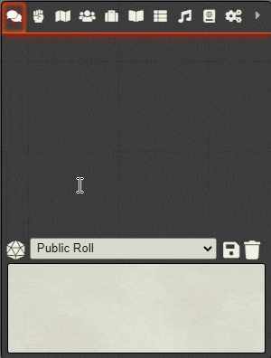

# Foundry VTT Quick Module Context Menu Settings

A depency module to quickly enable/disable client-side usage of parent modules. This is done by right-clicking on the `.chat-control-icon` - the d20 just above the chat message textarea.

